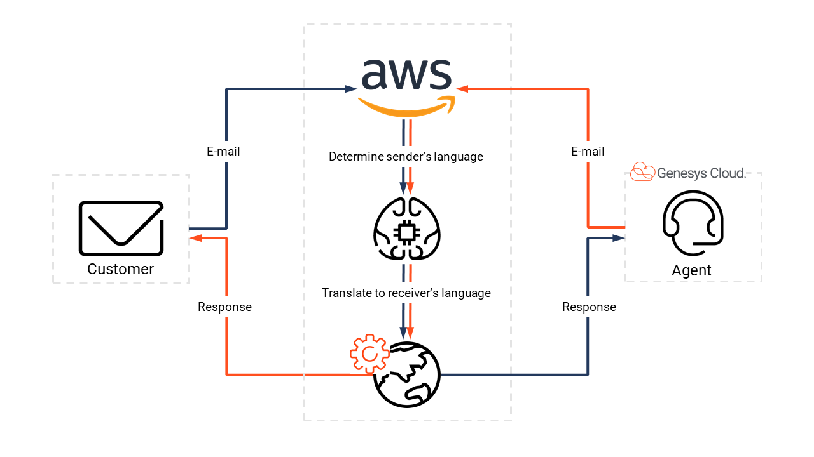

# Build an email translation assistant with the AWS Translate service

> View the full [Genesys Cloud Email Translator Blueprint article](https://developer.mypurecloud.com/blueprints/) on the Genesys Cloud Developer Center.

This Genesys Cloud Developer Blueprint provides instructions for building an email translation assistant which uses the AWS Translate service to allow customers and agents to email in their preferred languages. The email translation assistant automatically translates everything in the interaction window in real-time.

