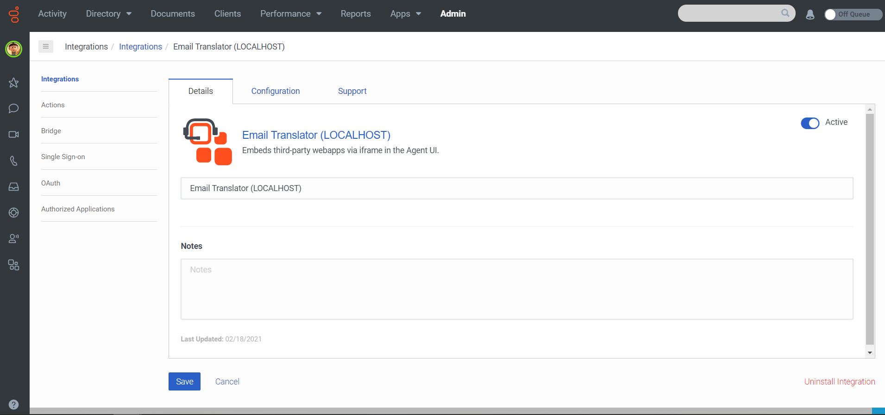
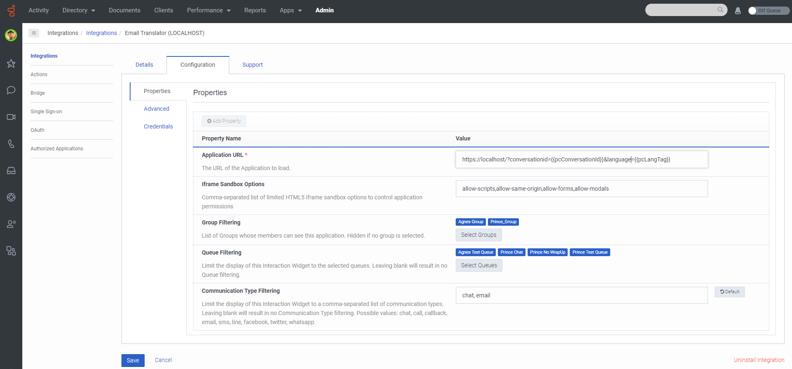
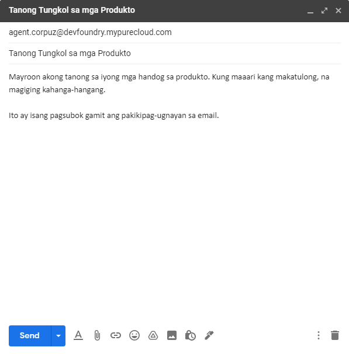
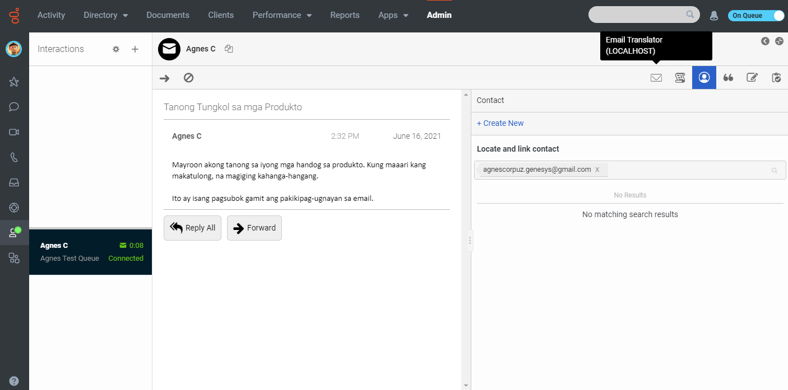
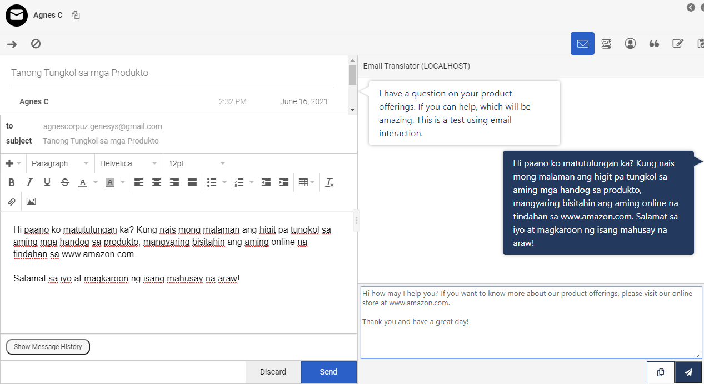

This Genesys Cloud Developer Blueprint provides instructions for building an email translation assistant which uses the AWS Translate service to allow customers and agents to email in their preferred languages. The email translation assistant automatically translates everything in the interaction window in real-time.


* [Solution components](#solution-components "Goes to the Solution components section")
* [Requirements](#requirements "Goes to the Requirements section")
* [Implementation steps](#implementation-steps "Goes to the Implementation steps section")
* [Additional resources](#additional-resources "Goes to the Additional resources section")

## Solution components

* **Genesys Cloud** - A suite of Genesys cloud services for enterprise-grade communications, collaboration, and contact center management. You deploy the Email Translator solution in Genesys Cloud.
* **Genesys AppFoundry** - The Genesys app marketplace for solutions that run on the Genesys Cloud platform. You download the integration used in this solution from the Genesys AppFoundry.
* **Interaction Widget integration** - The Genesys Cloud integration that enables web apps to be embedded in an iframe within Genesys Cloud. The iframe only appears on specified interaction types and to specified agents. For this solution, Genesys Cloud uses the Interaction Widget integration to show translated email messages to the customer.
* **AWS IAM** - Identity and Access Management that controls access to AWS resources such as services or features. In this solution, you set the permissions to allow the Email Translator to access Amazon Translate and the AWS SDK.
* **Amazon Translate** - A translation service that enables cross-lingual communication between users of an application. Amazon Translate is the translation service used in the Email Translator solution.

### Software development kits (SDKs)

* **Genesys Cloud Platform API SDK** -Client libraries used to simplify application integration with Genesys Cloud by handling low-level HTTP requests. This SDK is used for the initial email interaction between agent and customer.
* **AWS for JavaScript SDK** - This SDK enables developers to build and deploy applications that use AWS services. This solution uses the JavaScript API to enable the Email Translator in an agent's browser and it uses the inside Node.js applications to enable the Email Translator on the server where Genesys Cloud runs.

## Requirements

### Specialized knowledge

* Administrator-level knowledge of Genesys Cloud
* AWS Cloud Practitioner-level knowledge of AWS IAM, AWS Translate, and AWS for JavaScript SDK
* Experience using the Genesys Cloud Platform API

### Genesys Cloud account

* A Genesys Cloud license. For more information, see [Genesys Cloud Pricing](https://www.genesys.com/pricing "Opens the Genesys Cloud pricing page") in the Genesys website.
* The Master Admin role. For more information, see [Roles and permissions overview](https://help.mypurecloud.com/?p=24360 "Opens the Roles and permissions overview article") in the Genesys Cloud Resource Center.

### AWS account

* A user account with Administrator Access permission and full access to the following services:
  * IAM service
  * Translate service

## Implementation steps

* [Download the repository containing the project files](#download-the-repository-containing-the-project-files "Goes to the Download the repository containing the project files section")
* [Create a Token Implicit OAuth Grant for Genesys Cloud](#create-a-token-implicit-oauth-grant-for-genesys-cloud "Goes to the Create a Token Implicit OAuth Grant for Genesys Cloud section")
* [Set up AWS Translate](#set-up-aws-translate "Goes to the Set up AWS Translate section")
* [Install and activate the Email Translator in Genesys Cloud](#install-and-activate-the-email-translator-in-genesys-cloud "Goes to the Install and activate the Email Translator in Genesys Cloud section")
* [Host and run the Node.js app server](#host-and-run-the-node-js-app-server "Goes to the Host and run the Node.js app server section")
* [Setup email interaction](#setup-email-interaction "Goes to the Setup email interaction section")
* [Test the solution](#test-the-solution "Goes to the Test the solution section")

### Download the repository containing the project files

1. Clone the [email-translator-blueprint repository](https://github.com/AgnesCorpuz/email-translator-blueprint "Opens the email-translator-blueprint repository in GitHub").

### Create a token implicit OAuth grant for Genesys Cloud

1. Log in to your Genesys Cloud organization and create a new OAuth client that uses the Token Implicit Grant (Browser) type. For more information, see [Create an OAuth client](https://help.mypurecloud.com/articles/?p=188023 "Opens the Create an OAuth client article") in the Genesys Cloud Resource Center.
2. In your local blueprint repository, open the [config.js](https://github.com/AgnesCorpuz/email-translator-blueprint/blob/main/docs/scripts/config.js) file. Add the client ID from your OAuth client and specify the region where your Genesys Cloud organization is located, for example, `mypurecloud.ie` or `mypurecloud.com.au`.

### Set up AWS Translate

1. Create an IAM user for the application. For more information, see [IAM users](https://docs.aws.amazon.com/IAM/latest/UserGuide/id_users.html "Opens IAM users") in the AWS documentation.
2. Add a policy to the IAM that grants full access to the AWS Translate service. For more information, see [Managing IAM policies](https://docs.aws.amazon.com/IAM/latest/UserGuide/access_policies_manage.html "Opens Managing IAM policies") in the AWS documentation.
3. Create an access key for the IAM user. For more information, see [Managing access keys for IAM users](https://docs.aws.amazon.com/IAM/latest/UserGuide/id_credentials_access-keys.html "Opens Managing access keys for IAM users") in the AWS documentation.
4. Write down the access key and secret.
5. Create an .env file in the directory folder and provide values for the following variables: `AWS_REGION`, `AWS_ACCESS_KEY_ID`, and `AWS_SECRET_ACCESS_KEY`.

  :::primary
  **Tip**: Start with the sample.env file for this blueprint and provide your org-specific details.
  :::

### Install and activate the Email Translator in Genesys Cloud

1. Log in to your Genesys Cloud organization and add an integration. For more information, see [Add an integration](https://help.mypurecloud.com/?p=135807 "Opens the Add an integration article") in the Genesys Cloud Resource Center.

   

2. Install the **Interaction Widget** integration. For more information, see [Set up an Interaction Widget integration](https://help.mypurecloud.com/?p=229319 "Opens the Set up an Interaction Widget integration article") in the Genesys Cloud Resource Center.

   

3. (Optional) Use the **Name** box to give the widget a meaningful name. For example, **Email Translator**.

   

4. Click the **Configuration** tab.
5. In the **Application URL** box, type the URL of the web application. Be sure to specify the full URL, beginning with `https:`.

  ```
   https://localhost/?conversationid={{pcConversationId}}&language={{pcLangTag}}
  ```

   The `pcConversationId` parameter determines the conversation interaction. The `pcLangTag` parameter determines the agent's language in the Email Translator solution.

6. To limit access to specific groups of agents, in **Group Filtering**, select the groups that can use the widget.
7. To limit access to specific queues, click **Select Queues** and select the queues that can use the widget.
8. In the **Communication Type Filtering** box, type **email**.  

   

9. Click **Advanced** and enter the following code in the text area. Then save and activate the integration.

  ```{"language":"json"}
     {
       "lifecycle": {
         "ephemeral": false,
         "hooks": {
           "stop": true,
           "blur": true,
           "focus": true,
           "bootstrap": true
         }
       },
       "icon": {
          "48x48": "https://raw.githubusercontent.com/AgnesCorpuz/email-translator-blueprint/main/blueprint/images/email-48x48.png",
          "96x96": "https://raw.githubusercontent.com/AgnesCorpuz/email-translator-blueprint/main/blueprint/images/email-96x96.png",
          "128x128": "https://raw.githubusercontent.com/AgnesCorpuz/email-translator-blueprint/main/blueprint/images/email-128x128.png",
          "256x256": "https://raw.githubusercontent.com/AgnesCorpuz/email-translator-blueprint/main/blueprint/images/email-256x256.png"
      },
       "monochromicIcon": {
         "vector": "https://raw.githubusercontent.com/AgnesCorpuz/email-translator-blueprint/main/blueprint/images/email.svg"
       }
     }
  ```

### Host and run the Node.js app server

1. At a command line, verify that you are running Node.js v14.15.4 or later. Open a command line tool and type `node-v`.
  * To upgrade, type `nvm install 14.15.4`.
  * To install the latest version, type `npm install -g n latest`.


2. Switch to the directory where the files for your Email Translator project are located and install the dependencies in the local node-modules folder. In the command line, type `npm install`.
3. To run the server locally, in the command line type `node run-local.js`.

### Setup email interaction

1. Log in to your Genesys Cloud organization and add an email. For more information, see [Send and receive emails directly with the myPureCloud.com domain](https://help.mypurecloud.com/articles/send-and-receive-emails-directly-with-the-mypurecloud-com-domain/ "Opens the Send and receive emails directly with the myPureCloud.com domain article") in the Genesys Cloud Resource Center.
### Test the solution

1. To start an email interaction as a customer, send an email to your configured email address.
   
2. To answer the email as an agent, in your Genesys Cloud organization change your status to **On Queue** and then answer the incoming interaction.
  
3. To open the Email Translator, click the **Email Translator** button, which appears in the agent's toolbar.
4. Upon loading the Email Translator, the agent can see a message bubble with the translated message from the customer.
  
  :::primary
  **Tip**: The **Copy** button translates the agent's response to the customer's language and adds the translated message in the clipboard. The agent can then paste the translated message in the email response window before sending the message.

  The **Send** button automatically sends the agent's translated message to the customer and ends the interaction.
  :::

  

## Additional resources

* [Genesys Cloud Platform Client SDK](https://developer.mypurecloud.com/api/rest/client-libraries/ "Opens the Genesys Cloud Platform Client SDK page")
* [Genesys AppFoundry](https://appfoundry.genesys.com/filter/genesyscloud "Opens the Genesys AppFoundry")
* [Amazon Translate](https://aws.amazon.com/translate/ "Opens Amazon Translate page") in the AWS documentation
* [Email-translator-blueprint repository](https://github.com/AgnesCorpuz/email-translator-blueprint "Opens the email-translator-blueprint repository in GitHub")
